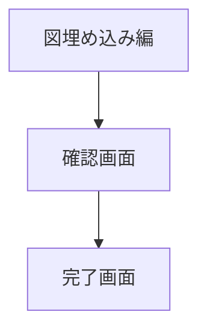
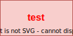

# example

- 基本的なMarkdown表示
- Mermaidコードブロック
- Draw.ioメタデータ付きSVGの表示・リンク
- ページサイズ変更

## 文字表示

### 文字幅確認

1234567890  
iiiiiiiiii  
oooooooooo  
llllllllll  
wwwwwwwwww  
あああああ  
いいいいい  

ここまで1ページ目 (A4)

## Mermaid 図埋め込み編

## drawio 図 (SVG)

<!--2ページ目 -->

## 2ページ目 (A3 横)

この部分は A3 横向きで出力されます。大きな図表の掲載に適しています。

<!-- 3ページ目 -->

## 3ページ目 (A4 に戻る)

A4 に戻りました。

<!-- 4ページ目 -->
<!--pdf-style
/* この部分はPDF変換時に <style>タグに置き換えられる。Githubで<style>タグ表示の防止のためにこのようにしている */
@page wide { size: 1280px 1920px; margin: 20px; }
.page-wide { page: wide; break-before: page; }
pdf-style-->

## 4ページ目 (1280x1920px カスタムサイズ)

任意のピクセルサイズも指定できます。

